## EJERCICIO 2:
### □ 2.1 - Crea un repositorio llamado repo02 desde GitHub. ¿Sería considerado un repositorio local o remoto?

*Es un repositorio remoto*

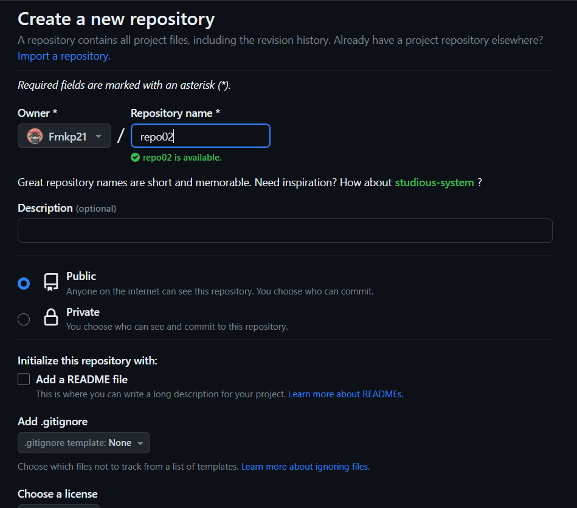

### □ 2.2 – Posteriormente, clónalo (mediante al comando git clone), lo que realizará una copia del repositorio remoto en nuestro equipo, creando con ello un repositorio local a partir del repositorio en remoto

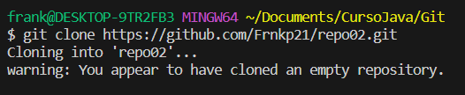

### 2-3 - Añade un fichero readme.md y ejecuta los comandos pertinentes hasta llegar a poder realizar un commit.

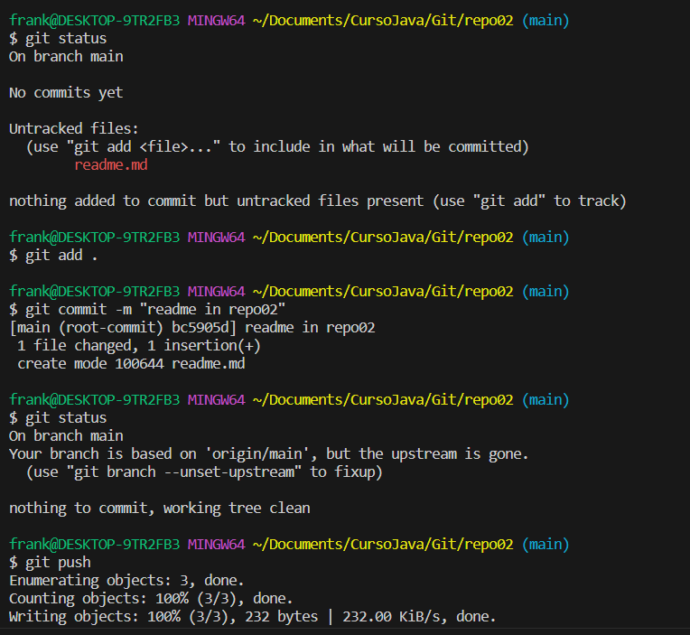

### 2.4 – Entra en este manual de Markdown y haz un resumen de los principales comandos de Git con los que hemos trabajando. Puedes utilizar tablas, imágenes, títulos, enlaces, etc.

# Comandos de git

**comando cd**

*Sirve para moverse entre directorios, como vemos en la imagen estabamos en el directorio git y hemos entrado al directorio repo02.*

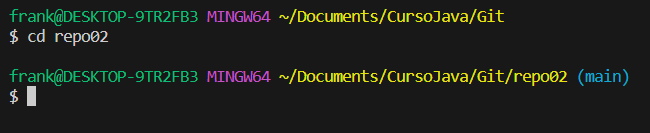

**comando cd ..**

*Con este comando tambien nos moveremos entre directorios pero este en especifico es para volver al directorio anterior.*
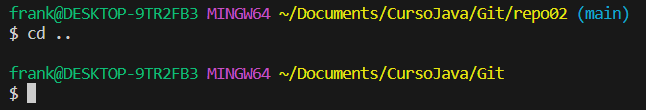

**comando mkdir**

*este comando es para crear directorios, como se ve en la foto hemos creado el directorio hola y con el comando ls podemos listar lo que tenemos en el directorio que estamos y ahi saldra el directorio que hemos creado en este caso hola.*
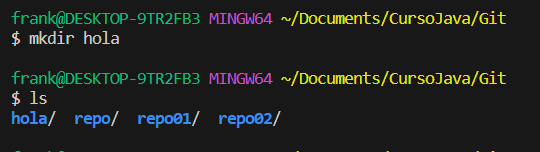

**comando rmdir**

*Es para borrar directorios, como vemos en la imagen hemos puesto el nombre del directorio que queremos eliminar y se eliminara.*
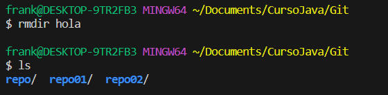

**comando pwd**

*Para saber donde estamos en el terminal*

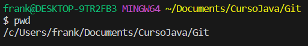

**Vincular tu cuenta de github a git**

*Esto lo deberiamos poner en el terminal con tu nombre de usuario de github y tu correo.*

*git config --global user.name "Bob"*

*git config --global user.email "bob@example.com"*

*Una vez hayas hecho esto puedes verlo con el comando:*

*git config user.name*

*git config user.email*

**comando git init**

*Este comando inicializara git en la carpeta en la cual lo hayamos ejecutado y esto creara una carpeta **.git** oculta.*

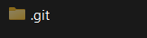

**comando git status**

*Esto es para ver el estado de los archivos que tenemos en nuestro directorio con git.*

*En este caso hemos modificado y agregado un archivo al directorio, cuando agregamos un archivo nuevo nos saldra en color rojo y pondra untracked files.*
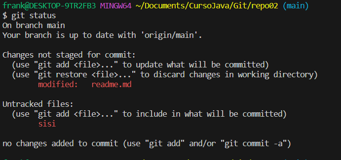

**comando git add**

  *Para subir los archivos tendremos que hacer un git add y despues cuando hagamos el git status nos saldra ne verde significa que los cambios estan commited*

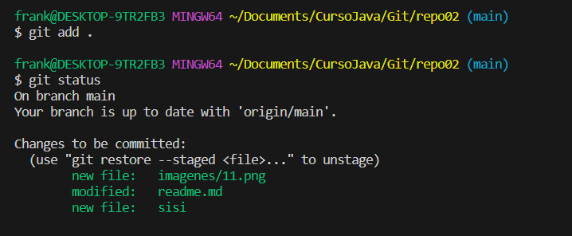

*Para borrar un archivo que no queremos que este committed tendremos que poner el git restore --staged <file\>*

**comando git commmit**

